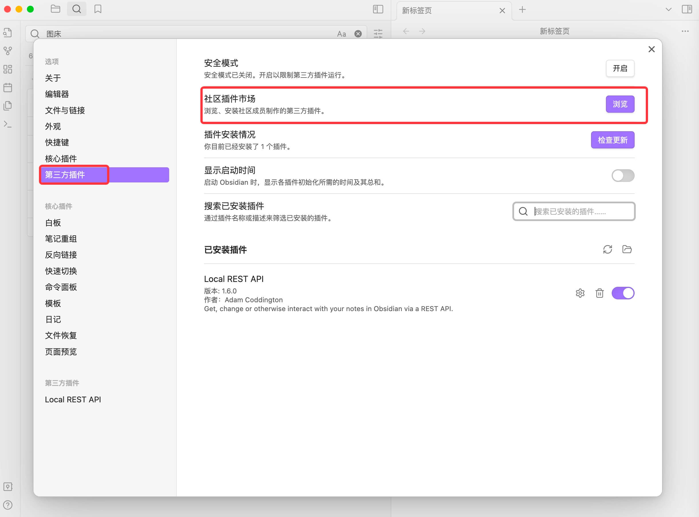
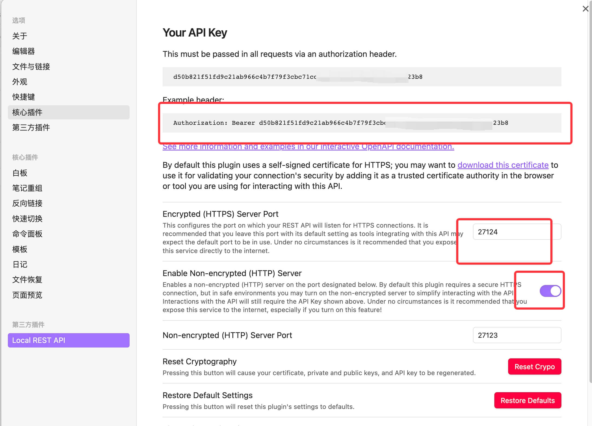
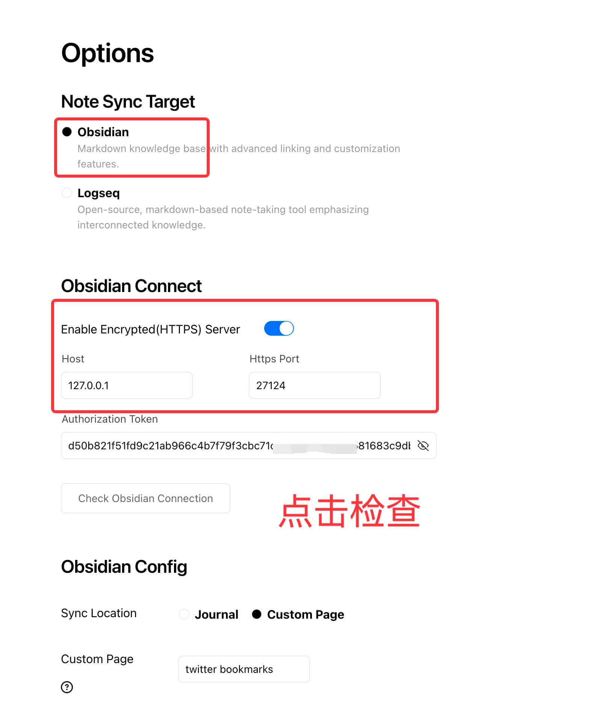
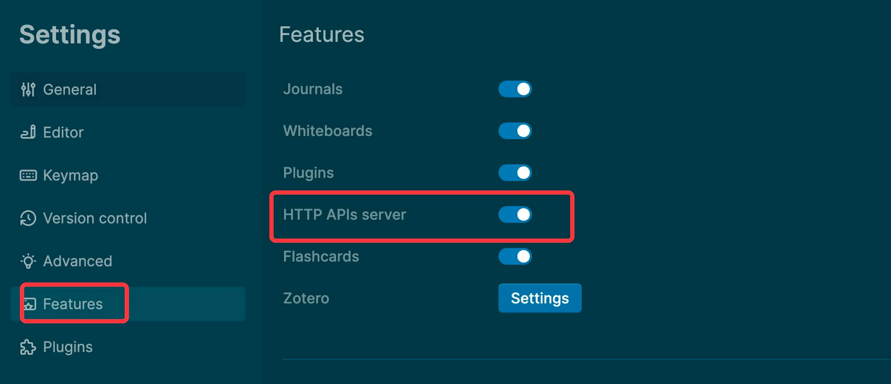
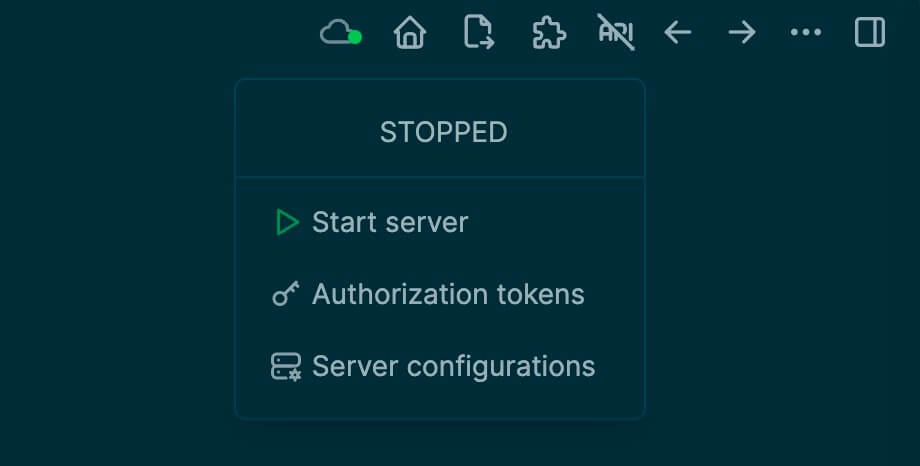
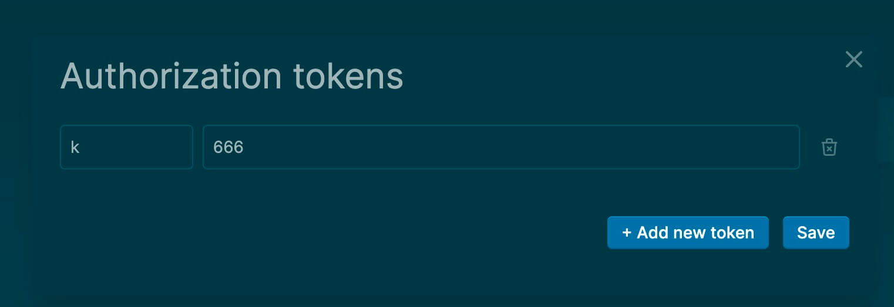
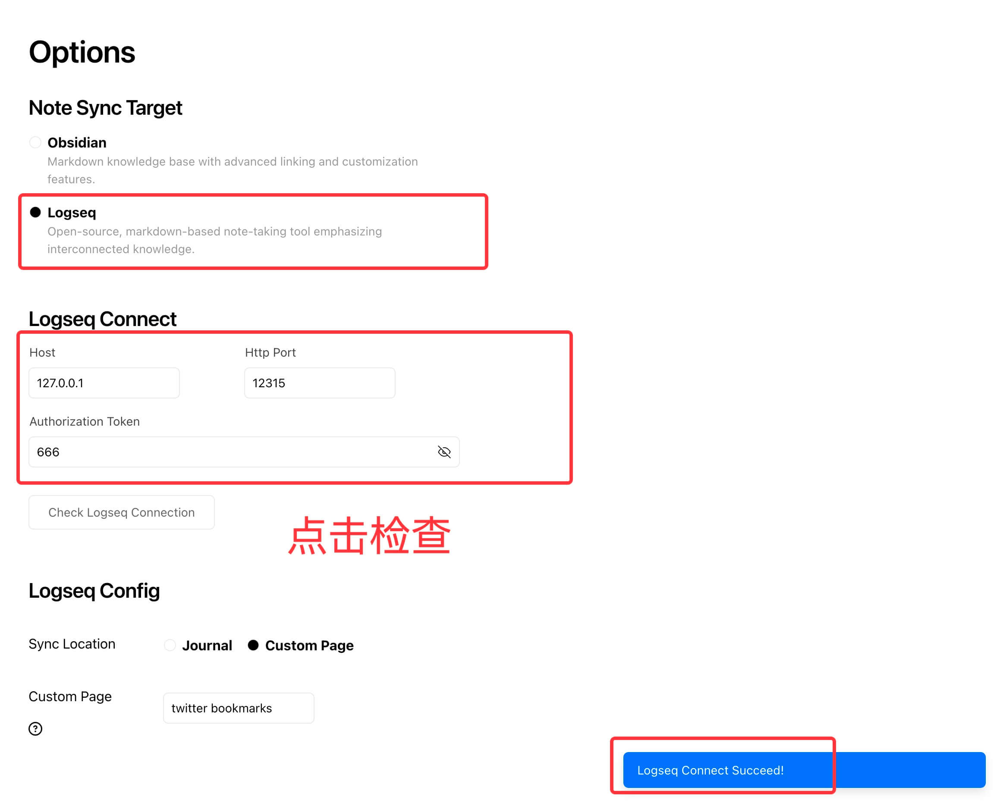
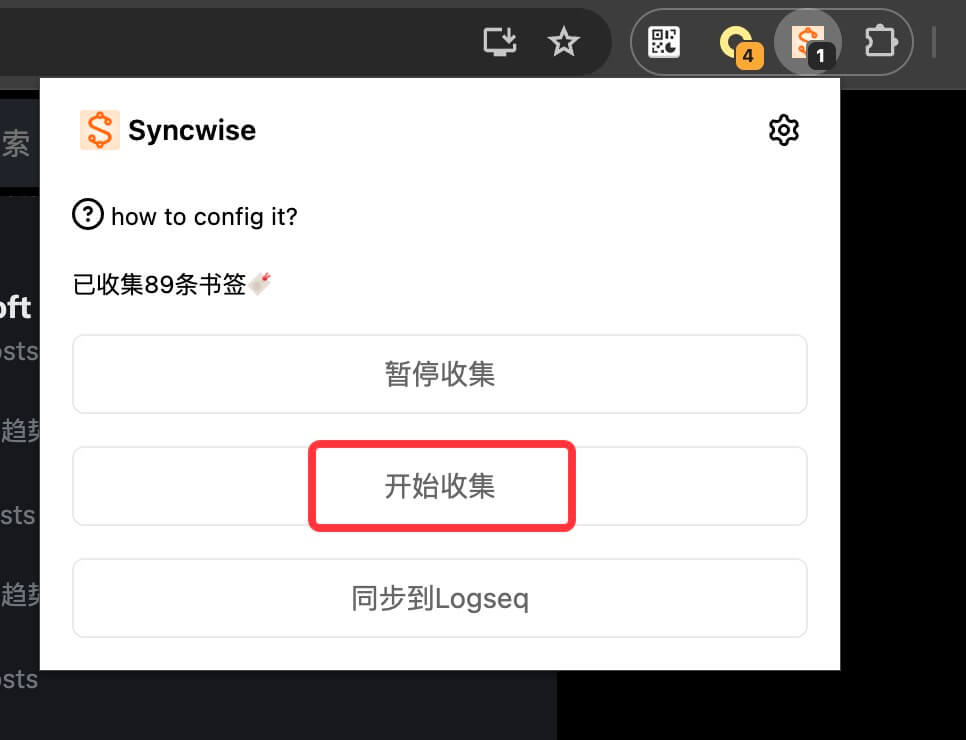

# Syncwise

## 同步指南

### 1. 启用笔记本同步

#### Obsidian 同步设置

- 请在 Obsidian 的插件市场下载并安装 **Local REST API** 插件。
  
- 配置 **Local REST API** 插件。
  
- 在 Syncwise 的配置页面确保 Obsidian 可以通过浏览器插件进行连接。
  

#### Logseq 同步设置

- 在 Logseq 中启用 **Http API server** 功能。
  
- 开启 **Http API server** 并设置访问令牌（token）。
  
  
- 在 Syncwise 的配置页面检查是否可以通过浏览器插件连接到 Logseq。
  

### 2. 开启 Twitter 笔记同步

- 在 Twitter 页面上，点击 Syncwise 面板的【开始收集】按钮，并等待页面自动滚动至底部。
  

## 常见问题解答

### Q: 使用此功能会导致账号被封锁吗？
**A:** 不会。

### Q: 数据的隐私性如何？
**A:** 我**高度**重视你的隐私保护，纯本地代码。
